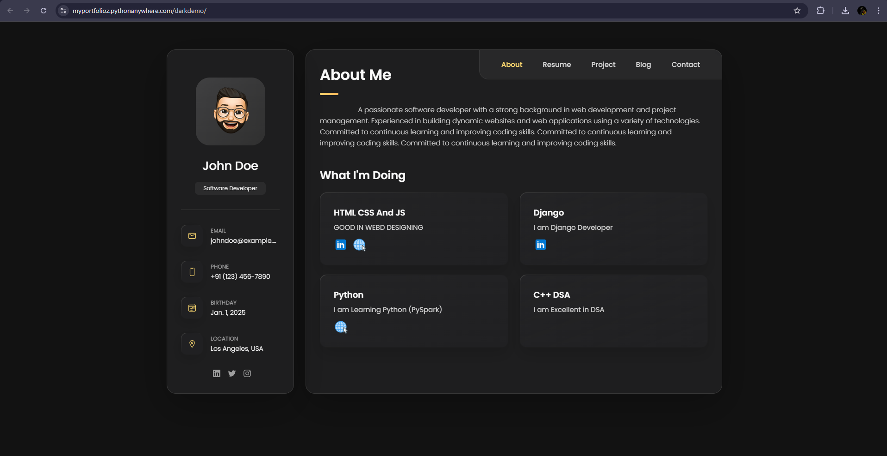
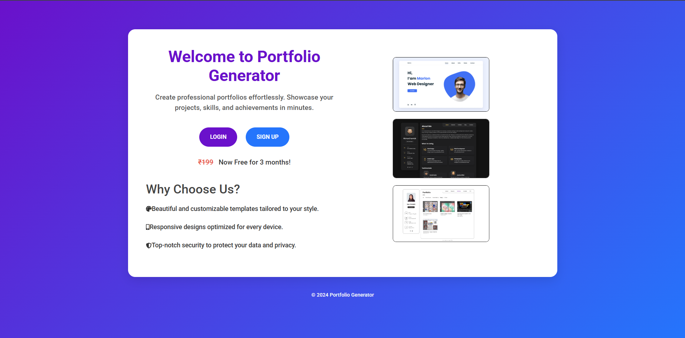
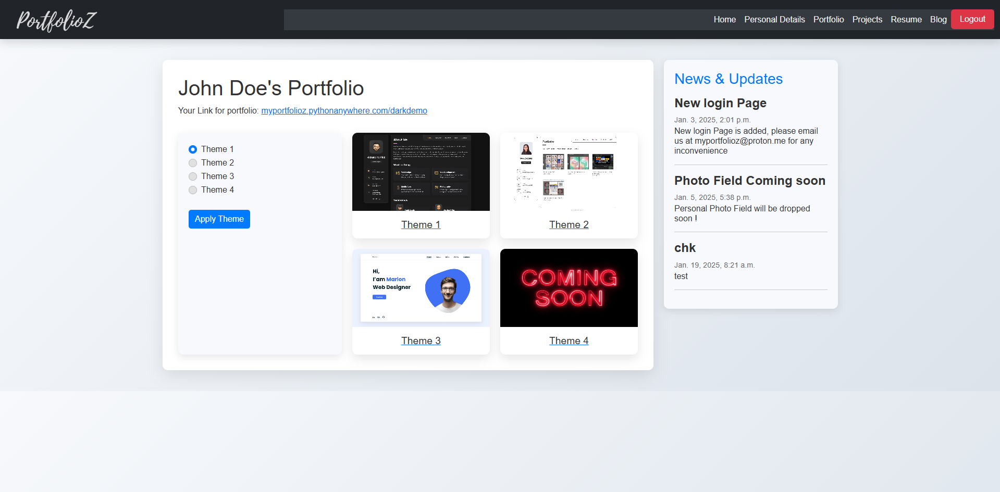
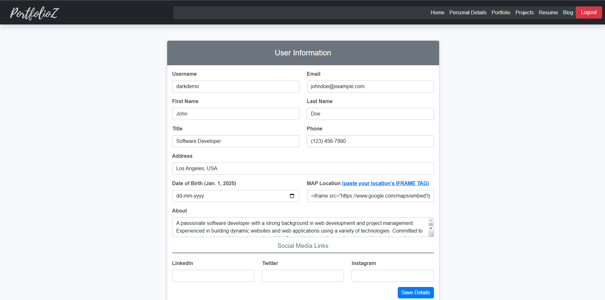
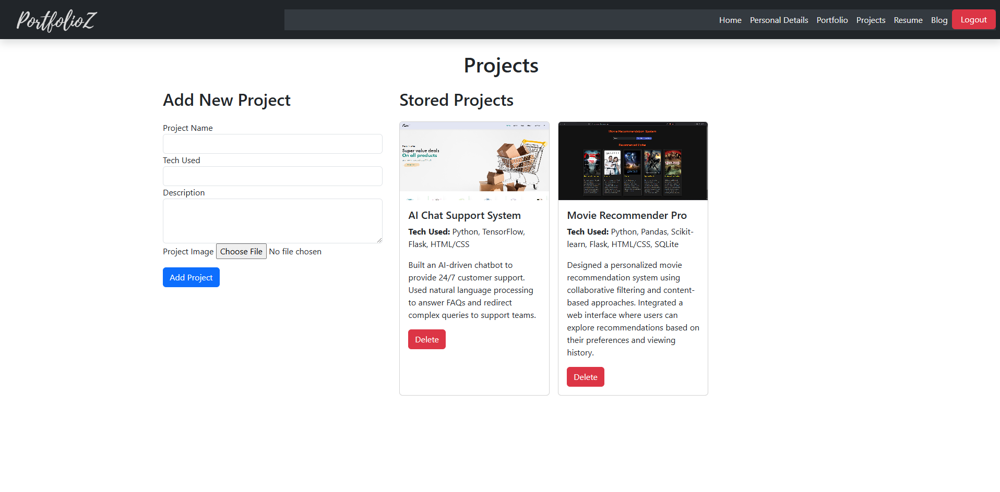

# Portfolio Generator

A web application that allows users to create personalized portfolios, choose templates, and share them via unique links.

## Features
- User authentication
- Admin panel for data updates
- Dynamic portfolio templates
- Hosted on PythonAnywhere

## Screenshots

### Portfolio View

### Landing Page

### Admin Home Page

### Data Management Page

### Project Management Page

## Technologies Used
- Django
- SQLite
- Bootstrap
- PythonAnywhere

## Getting Started
[Access](https://myportfolioz.pythonanywhere.com/login)
